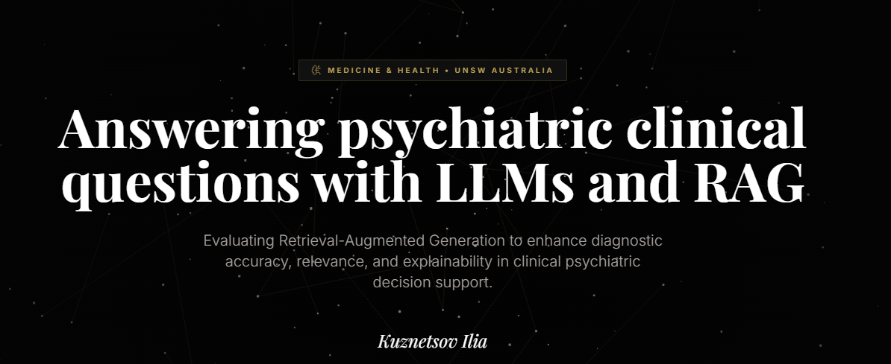

# RAG for Psychiatric Medical Question Answering



This repository contains the full research pipeline for a 2025 dissertation evaluating Retrieval-Augmented Generation (RAG) on a psychiatry-focused medical question-answering task. The project curates a dataset of 737 psychiatry questions from MedQA-Open, builds two RAG pipelines backed by clinical reference documents, and compares vanilla versus RAG-augmented responses across four large language models using automated metrics and rubric-based scoring.

---

## Repository Structure

| Folder / File | Description |
|---------------|-------------|
| [`data/`](data/) | Dataset preparation pipeline and knowledge base. Three-stage LLM classification filters ~10,000 MedQA-Open questions down to 737 verified psychiatry questions. Contains clinical reference PDFs and final train/test splits. |
| [`pipelines/naive_rag/`](pipelines/naive_rag/) | Baseline RAG pipeline: PDF ingestion into ChromaDB → retrieval with query rewriting → LLM answer generation. Includes RAGAS evaluation scripts. |
| [`pipelines/evaluation/`](pipelines/evaluation/) | Shared evaluation utilities (semantic similarity metric). |
| [`2025-06 Alternative pipeline with semantic chunking and hybrid search/`](<2025-06 Alternative pipeline with semantic chunking and hybrid search/>) | Experimental advanced RAG pipeline using Qdrant with semantic chunking and hybrid search. Includes async evaluation, faithfulness, and rubric-based scoring variants. |
| [`2025-07 Naive RAG pipeline Qdrant/`](<2025-07 Naive RAG pipeline Qdrant/>) | Simplified Qdrant-based RAG variant for comparison against the Chroma naive RAG baseline. |
| [`analysis/`](analysis/) | Final evaluation results: compares all four LLMs (vanilla vs. RAG) using RAGAS metrics and rubric scoring, with confidence intervals, t-tests, and per-diagnostic-category breakdowns. |
| [`experiments/`](experiments/) | Exploratory notebooks for cluster analysis and Llama 4 Scout result inspection. |
| [`shiny/`](shiny/) | R Shiny web dashboard for interactive comparison of model answers by psychiatric category. |

---

## Research Pipeline

```
MedQA-Open (~10,178 questions)
        │
        ▼
[ data/ ]  3-stage LLM classification
        │  → 737 verified psychiatry questions (11 categories)
        │
        ├──► [ pipelines/naive_rag/ ]   ChromaDB + query rewriting
        │
        └──► [ 2025-06 Alternative/ ]   Qdrant + semantic chunking + hybrid search
                        │
                        ▼
             [ analysis/ ]  Vanilla vs. RAG comparison
                            4 LLMs × 5 RAGAS metrics × 11 categories
                            Statistical testing + rubric scoring
```

---

## Models Evaluated

| Model | Parameters |
|-------|-----------|
| DeepSeek V3 | 671B (MoE) |
| ExaOne 3.5 32B | ~31B |
| Meta Llama 4 Scout | 17B active / 109B total |
| Meta Llama 4 Maverick | 17B active / 400B total |

---

## Evaluation Metrics

- **Answer Semantic Similarity** — cosine similarity between generated and reference answers
- **Answer Relevance** — how well the answer addresses the question
- **Faithfulness** — whether the answer is grounded in retrieved context
- **Context Recall** — coverage of relevant information in retrieved chunks
- **Context Precision** — proportion of retrieved chunks that are relevant
- **Rubric Score (1–4)** — manual quality assessment of medical accuracy

---

## Knowledge Base

Seven clinical reference documents (NICE guidelines) cover the following psychiatric conditions:

- Anorexia nervosa
- Bipolar disorder in adults
- Bulimia nervosa
- Depression in adults
- Post-traumatic stress disorder (PTSD)
- Postnatal depression
- Schizophrenia

---

## Tech Stack

| Layer | Technology |
|-------|-----------|
| Language | Python 3.13, R |
| RAG orchestration | LlamaIndex |
| Vector stores | ChromaDB, Qdrant |
| Embeddings | `sentence-transformers/all-mpnet-base-v2`, Google GenAI Embeddings |
| LLM API | Google Gemini (data prep & generation) |
| Evaluation | RAGAS 0.4 |
| Data | pandas, PyMuPDF |
| Dashboard | R Shiny |
| Dependency management | uv |

---

## Setup

```bash
# Install dependencies using uv
uv sync
```

Requires Python 3.13. A Google Gemini API key is needed for the data preparation and generation pipelines.
