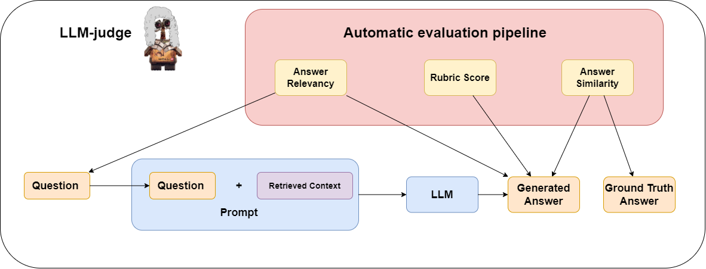

# Evaluation Pipeline

This folder contains scripts for evaluating generated answers with RAGAS metrics.

| Metric | Script | High-level description |
| --- | --- | --- |
| `answer_relevancy` | `ragas_answer_relevancy_faithfulness.py` | Evaluates whether the generated RAG answer is relevant to the modified user question. The script uses the question, generated RAG answer, and retrieved contexts as the RAGAS input. |
| `faithfulness` | `ragas_answer_relevancy_faithfulness.py` | Evaluates whether the generated RAG answer is supported by the retrieved context. The script runs this metric on RAG answers and stores per-run scores plus a mean score. |
| `semantic_similarity` | `ragas_semantic_similarity.py` | Evaluates how semantically similar a generated answer is to the reference reasoning. The script supports both vanilla answers and RAG answers, using Gemini embeddings through RAGAS. |

