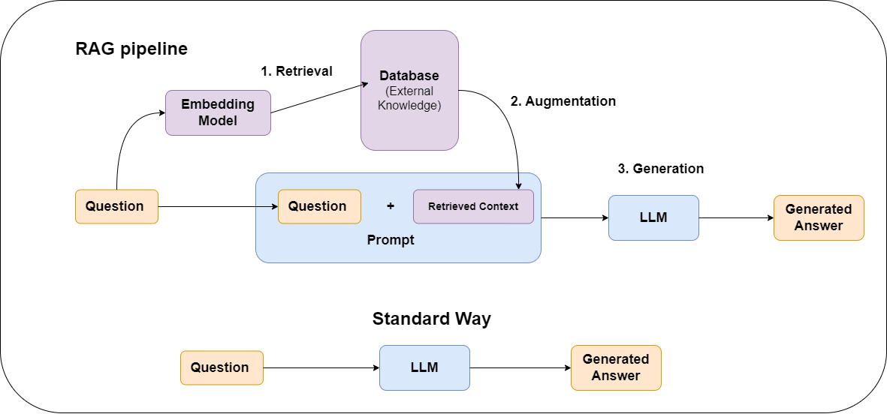

# Naive RAG Pipeline

This folder contains the first retrieval-augmented generation (RAG) pipeline for
the dissertation project. The pipeline follows a simple RAG structure: ingest
source documents, store their embeddings in a vector database, retrieve relevant
context for each question, and generate answers with an LLM.

The goal of this pipeline is to provide a clear baseline that later pipelines can
improve on with more advanced chunking, retrieval, reranking, or evaluation
methods.

## 01_naive_rag_ingest_pdfs_to_chroma.py

This script prepares the document collection for retrieval.

At a high level, it:

- loads PDF source documents,
- splits the documents into text chunks,
- creates embeddings for each chunk,
- stores the embedded chunks in a persistent Chroma vector database.

This is the ingestion stage of the RAG pipeline. It runs before answer
generation and creates the searchable knowledge base used by later steps.

## 02_answer_questions_with_naive_rag_and_query_rewriting.py

This script generates answers for the test questions.

At a high level, it:

- loads the persisted Chroma vector store created by the ingestion script,
- rewrites each user question into a concise search query,
- retrieves relevant document chunks from the vector store,
- generates a RAG answer using the retrieved context,
- generates a vanilla LLM answer without retrieved context for comparison,
- saves the generated answers and retrieved context to a CSV file.

This is the answer-generation stage of the pipeline. The query rewriting step is
used to make retrieval more focused by turning a full question into a shorter
search query built around the key medical concepts.
