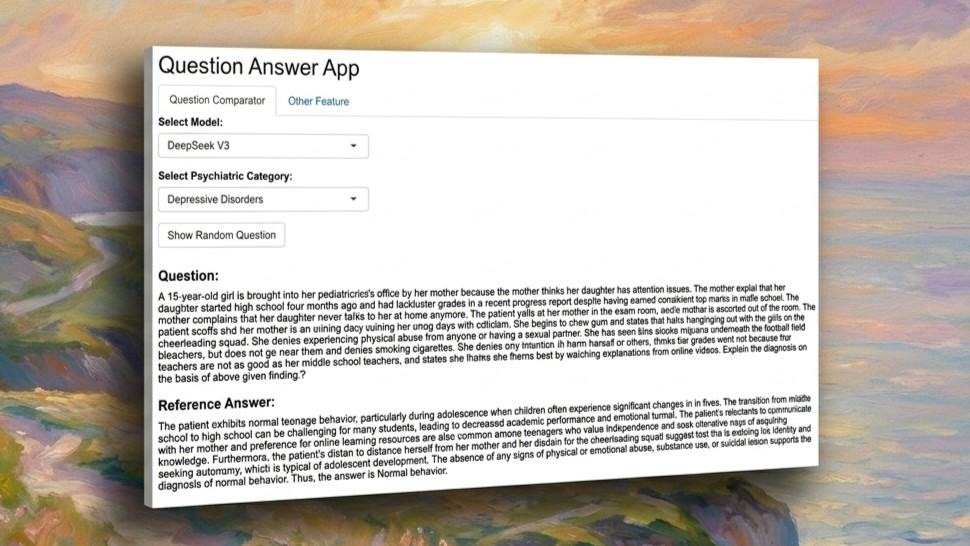

# Shiny Experiment Dashboard



This folder contains the Shiny dashboard for browsing sample questions and answers from the experiments.

Deployed dashboard: <https://kuznetsov-rar.shinyapps.io/shiny/>

## Files

- `app.R` - Shiny application code.
- `run_app.R` - Local launcher for the dashboard.
- `random_questions_by_category.csv` - Sample questions and answers used by the dashboard.

## Run Locally

From this folder, run:

```r
shiny::runApp()
```

Or from the repository root, run:

```r
source("shiny/run_app.R")
```
